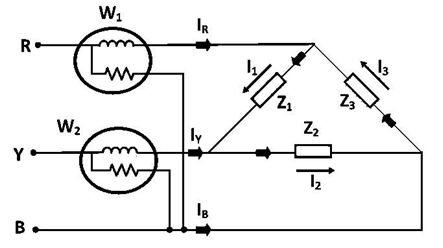

### INTRODUCTION

In a three phase system load can be connected in star or delta having impedance per phase as: 

$Z_{ph} = R_{ph} + jX_{ph} = |Z| \angle \Phi$

The reactance X can be positive or negative depending on the capacitive or inductive load. The wattmeter must be connected properly in the three-phase system to connect power. Here, ∠Φ= angle between Vph and Iph. For any load, delta or star connected three phase power is given by:

 
 

$ P = \sqrt{3} V_L I_L \cos\Phi = 3 V_{ph} I_{ph} \cos\Phi$
 

Where, cosΦ is called the power factor. For resistive load, cosΦ=1 

The wattmeter must be connected properly in the three-phase system to connect power. Two wattmeter method is commonly used for the power measurement in the 3 phase circuits. Here as name suggests, only two wattmeters are used. The current coils of the two wattmeters are connected in series on any two lines while the voltage coil of each wattmeter is connected between its own current coil terminal and the line without current coil. For example, the current coils are inserted in the lines R and Y then the pressure coils are connected between R-B for one wattmeter and Y-B for another wattmeter. The connections in two wattmeter method are same irrespective of load connected in star or delta. When the two wattmeters are connected in this way, the algebraic sum of the two wattmeter readings give the total power dissipated in the three-phase circuit. 

If W1 and W2 are the two wattmeters reading then total power is, 

 

$ W = W_1 + W_2 = 3\Phi$

The circuit may be taken as balanced or unbalanced one, balanced type being only a special case. 

<b>LOAD CONNECTED AS STAR CONNECTION</b> 

If star connected circuit is taken as an example as shown in figure 1  
 
  
   
 Figure 1: Load Connected As Star Connection 
  

So, the total instantaneous power consumed in the circuit is,  

 

$ W = I_{RN} \cdot V_{RN} + I_{YN} \cdot V_{YN} + I_{BN} \cdot V_{BN} \quad \text{........(1)} $

Each of the terms in the above expression equation (1) is the instantaneous power consumed by the phases. Consider star connected balanced load as shown From the connection diagram, the circuit in and the voltages across the respective (current, pressure or voltage) coils in the wattmeter, W1 are IRN and VRY = VRN - VYN.
 

So, the instantaneous power measured by the wattmeter W1 is 

 

$ W_1 = I_{RN} \cdot V_{RY} = I_{RN} \cdot (V_{RN} - V_{YN})
) $ 

Similarly, the instantaneous power measured by the wattmeter W2 is  

$ W_2 = I_{BN} \cdot V_{BY} = I_{BN} \cdot (V_{BN} - V_{YN})$

Hence the total power is

$ W = W_1 + W_2 = I_{RN} \cdot (V_{RN} - V_{YN}) + I_{BN} \cdot (V_{BN} - V_{YN})$

$W = I_{RN} \cdot V_{RN} - I_{RN} \cdot V_{YN} + I_{BN} \cdot V_{RN} - I_{BN} \cdot V_{YN}$

$W = I_{RN} \cdot V_{RN} + I_{BN} \cdot V_{RN} - V_{YN} \cdot (I_{RN} + I_{BN})$

And since,

$I_{RN} + I_{BN} + I_{YN} = 0 $

So,

$ W_1 + W_2 = I_{RN} \cdot V_{RN} + I_{BN} \cdot V_{BN} + I_{YN} \cdot V_{YN}$

$ W_1 + W_2 = P_1 + P_2 + P_3$

Where P1, P2 and P3 are the instantaneous values of power consumed by each phase of the load at the instant considered regardless of power factor. Hence at any instant, addition of two wattmeter reading always gives instantaneous total power consumed by the circuit. 

<b>DELTA CONNECTED LOAD</b> 

Consider delta connected balanced load as shown in the figure 2, 

   
Figure 2: Delta Connected Load 
   

From the connection diagram, the circuit in and the voltages across the respective (current, pressure or voltage) coils in the wattmeter, W1 are VRB   and IR = I1 – I3. So, the instantaneous power measured by the wattmeter W1 is

$ W_1 = I_R \cdot V_{RB} = V_{RB} \cdot (I_1 - I_3)$

Similarly, the instantaneous power measured by the wattmeter W2 is 

$ W_2 = I_Y \cdot V_{YB} = V_{YB} \cdot (I_2 - I_1)$

Hence, The total power is

$W = W_1 + W_2 = V_{RB} \cdot (I_1 - I_3) + V_{YB} \cdot (I_2 - I_1)$

$W = V_{RB} \cdot I_1 - V_{RB} \cdot I_3 + V_{YB} \cdot I_2 - V_{YB} \cdot I_1$

$W = V_{YB} \cdot I_2 + V_{BR} \cdot I_3 - I_1(V_{YB} + V_{BR})$

$V_{RY} + V_{YB} + V_{BR} = 0$

$W_1 + W_2 = I_1 \cdot V_{RY} + I_2 \cdot V_{YB} + I_3 \cdot V_{BR}$

$W_1 + W_2 = P_1 + P_2 + P_3$

Hence, at any instant, addition of two wattmeter reading always gives instantaneous total power consumed by the circuit.

### <b> Advantages of Two Wattmeter Method: </b>

1. This method is applicable for balanced as well as unbalanced load.

2. Neutral point for star connected load is not necessary to connect the wattmeters.

3. The delta connected load, need not to be opened for connecting the wattmeters.

4. Only two wattmeters are sufficient to measure total three-phase power.

5. If the load is balanced not only the power but the power factor also can be determined.

### <b> Disadvantages of Two Wattmeter Method: </b>

1. Not applicable for three phase, 4 wire system.

2. The signs of W1 and W2 must be noted down correctly otherwise it may lead to the wrong results.

